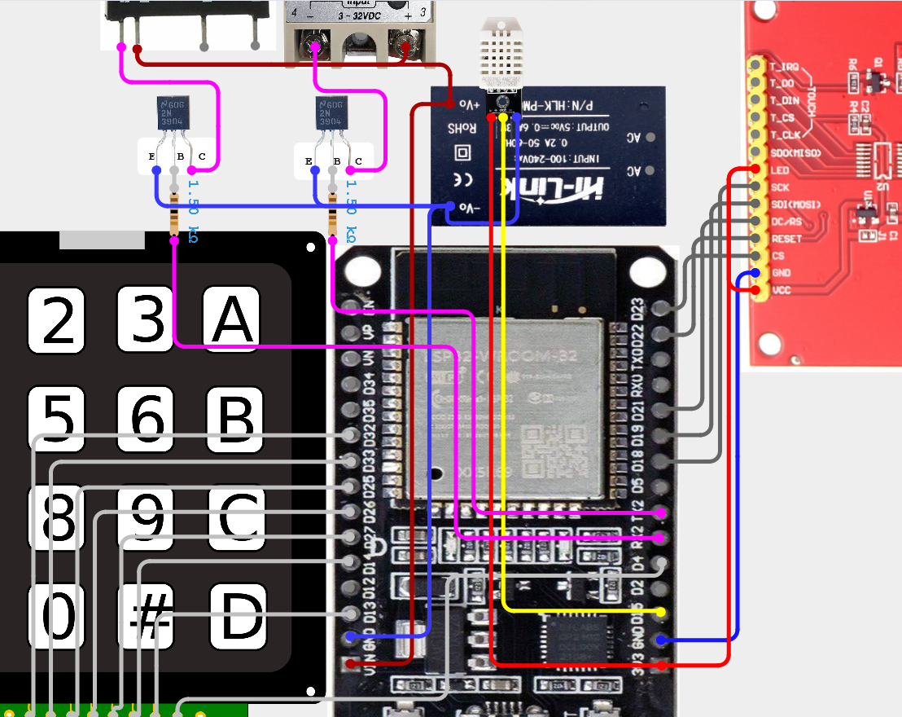

# Heat & Humidity Environmental Testing System

## Overview
This repository contains firmware for an ESP32-based environmental testing chamber. The system actively monitors temperature and humidity utilizing a DHT22 sensor and regulates environmental conditions by toggling external heater and humidifier relays. It includes a local TFT SPI display, a 4x4 matrix keypad for parameter configuration, and USB serial data telemetry.

## Hardware Specifications and Pin Mapping

### Microcontroller
*   ESP32 Development Board (30 pin)

### Sensor
*   **Model:** DHT22 (pull up HIGH)
*   **Data Pin:** GPIO 15

### Relays
*   **NPN BJT:** 2N3904 (2x)
*   **Heater Control:** GPIO 17 (Active HIGH)
*   **Humidifier Control:** GPIO 16 (Active HIGH)

### 4x4 Matrix Keypad
*   **Row Pins (1-4):** GPIO 27, 14, 13, 4
*   **Column Pins (1-4):** GPIO 32, 33, 25, 26

### TFT SPI Display
*   **Driver:** ILI9488
*   **MOSI:** GPIO 19
*   **SCLK:** GPIO 18
*   **CS:** GPIO 23
*   **DC:** GPIO 21
*   **RST:** GPIO 22
*   **MISO:** Not connected (-1)

## Software Dependencies
This project requires PlatformIO. The following libraries are defined in the `platformio.ini` environment:
*   `adafruit/DHT sensor library` (v1.4.6)
*   `adafruit/Adafruit Unified Sensor` (v1.1.14)
*   `chris--a/Keypad` (v3.1.1)
*   `bodmer/TFT_eSPI` (v2.5.43)

*Note: The `TFT_eSPI` configuration is handled via build flags in `platformio.ini`. Modifying `User_Setup.h` is not required.*

## Operation and Controls

### Startup Sequence
1.  System initializes serial communication at 115200 baud.
2.  Initial target setpoints default to 50.0 C and 95.0% RH (as per current helmet contract).

### Keypad Interface
*   **`A`**: Initiate target temperature entry.
*   **`B`**: Initiate target humidity entry.
*   **`C`**: Insert decimal point.
*   **`*`**: Backspace/Delete last character, or cancel current input mode.
*   **`#`**: Confirm numerical entry and save to the selected setpoint.
*   **`0`-`9`**: Numerical input (limited to 5 characters)

### Control Logic
*   The DHT22 is polled every 2000 milliseconds. (READ_INTERVAL)
*   If the current temperature is below the target temperature, the heater relay is energized.
*   If the current humidity is below the target humidity, the humidifier relay is energized.

### Fail-Safe Mechanism
*   If the DHT22 fails to return valid data (returns `NAN`), both the heater and humidifier relays are immediately forced LOW (disabled) to prevent runaway events.
*   The TFT display will output "Error" in place of the numerical readings.

## USB Serial Telemetry
The ESP32 continuously exports sensor state data over the physical USB connection via the UART interface.
*   **Baud Rate:** 115200.
*   **Payload Format:** Comma-separated string prefixed with a data identifier: `DATA,<Temperature_C>,<Humidity_RH>`.
*   **Transmission Condition:** Packets are only dispatched when valid, non-NAN sensor readings are acquired.

## Hardware Documentation

### Wiring Diagram
